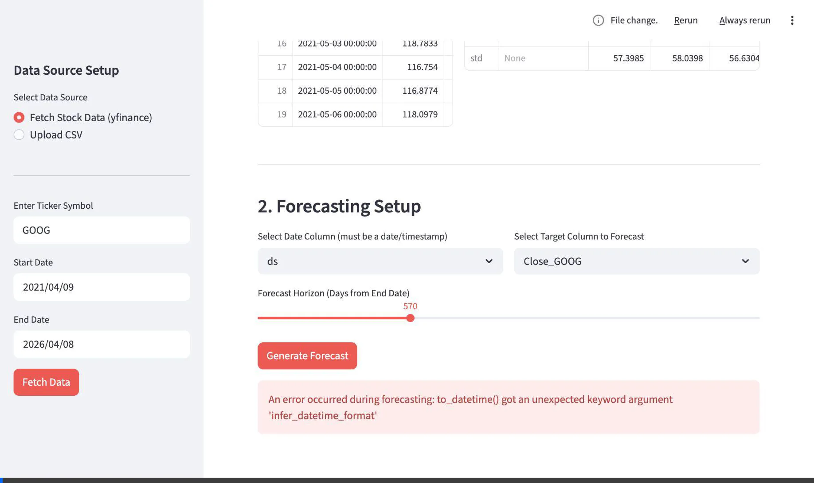
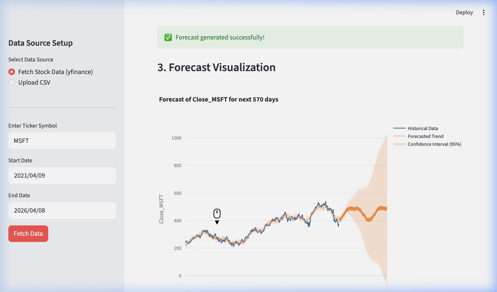

# Financial Forecasting Web Tool 📈

An interactive, web-based application for financial forecasting built purely in Python. It leverages **Meta's Prophet** algorithm to predict future trends such as business revenue, expenses, or stock prices based on historical data.

---

## 📸 Demonstration

### Full Video Walkthrough
Watch the application fetch live data, run the machine learning model, and generate an interactive forecast visualization:



### Interactive Forecasting
The tool displays historical data and a future projection with a 95% confidence interval clearly plotted using Plotly:



---

## Features ✨
- **Dual Connection**: Upload your own custom historical data via CSV, or automatically fetch live stock market data using `yfinance` by just entering a ticker symbol (e.g., `AAPL`, `MSFT`).
- **Data Insights**: Instantly view raw data snapshots and summary statistics for your datasets.
- **AI-Driven Forecasting**: Leverages Meta's `prophet` model to automatically handle seasonality and output statistically sound future predictions. 
- **Interactive Visualizations**: Explore historical and future predictions simultaneously on zoomable, responsive `Plotly` graphs, complete with 95% confidence intervals.
- **Data Export**: Seamlessly download the generated future timeline securely to a CSV file.

## Setup & Installation 🚀

To run this application locally, ensure you have Python 3.9+ installed and follow these steps:

1. **Clone the repository**:
   ```bash
   git clone https://github.com/saloni2312/financial-forecasting-web-tool.git
   cd financial-forecasting-web-tool
   ```

2. **Create a virtual environment** (Highly recommended to isolate dependencies):
   ```bash
   python3 -m venv venv
   source venv/bin/activate  # On macOS/Linux
   ```

3. **Install the dependencies**:
   ```bash
   pip install -r requirements.txt
   ```

4. **Launch the application**:
   ```bash
   streamlit run main.py
   ```
   *The web tool will automatically open in your default browser at `http://localhost:8501/`.*

## Tech Stack 🛠️
- `Streamlit` (Interactive Web Framework)
- `Prophet` (Time-Series Forecasting Engine)
- `Plotly` (Interactive Charting)
- `yfinance` (Live Financial API integration)
- `pandas` (Data Processing)
